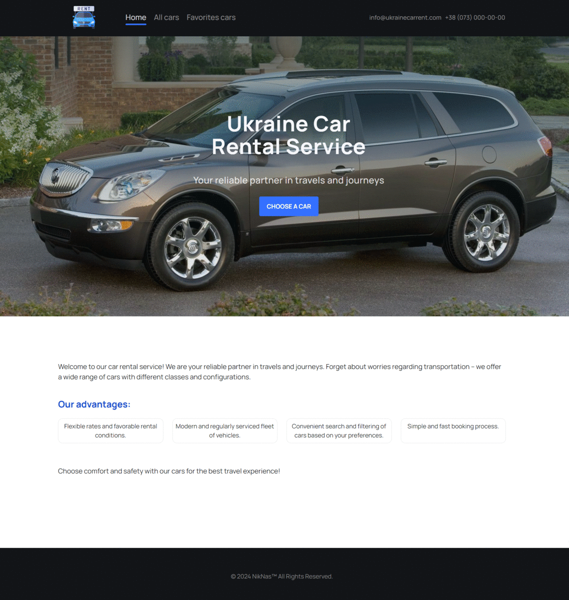

# project-ukraine-car-rent

Hello, strangers! Allow me to introduce you to to Ukraine Car Rental Service:
application for a car rental company in Ukraine.

The application consists of 3 pages: 🌟 a homepage with a general description of
the services provided by the company; 📖 a page containing a catalog of cars
with different configurations, which you can filter by brand, hourly rental
price, and the number of kilometers the car has traveled (mileage); 💪a page
with ads that you have added to your favorites.

# Technologies used:

Frontend:

- HTML/CSS,
- JS,
- React,
- Redux,
- Persist,
- Axios.

Backend:

- MockAPI.
